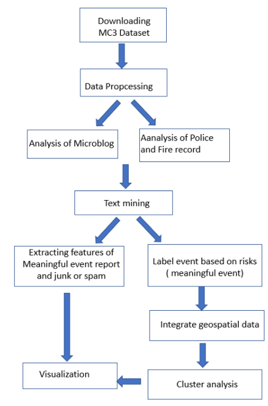
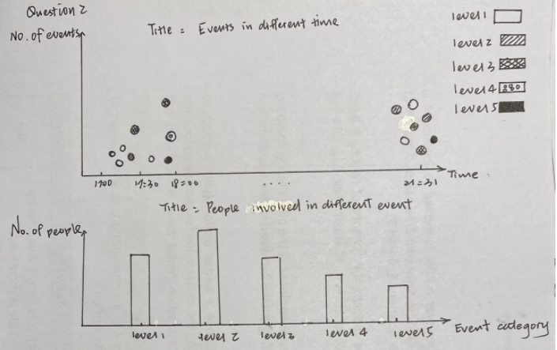
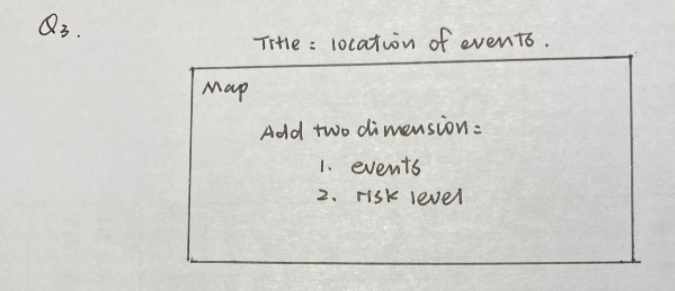

```{r setup, include=FALSE}
knitr::opts_chunk$set(echo = FALSE)
```

# 1.0 Background
  
### Introduction

In the country island of Kronos, the increasing noxious effects on health and farming have been related to the uncontrolled activity of GAStech, a natural gas operator, supported by corrupt government officials. On January 20th, 2014, a corporate meeting is held to celebrate the new-found fortune because of the initial public offering of the company. However, a series of rare events occur that lead to the disappearance of several employees. The Protectors of Kronos
(POK), a social movement organization that has been fighting against water contamination and government corruption, is suspected in the disappearance.

As analysts, we were assigned with several tasks in order to identify risks and how they could have been mitigated more effectively.

### Objective
Using data and visual analytics to evaluate the changing levels of risk to the public and recommend actions for first responder:

* Distinguish meaningful event reports from typical chatter from junk or spam.
* Evaluate the level of the risk to the public evolves over the course of the evening. Consider the potential consequences of the situation and the number of people who could be affected.
* Determine the appropriate location for first responders. 
* The differences between dealing with this challenge in 2014 and dealing with it now.

---

# 2.0 Data Source

The data source is from [<font color = blue>*Vast Challenge 2021.*</font>](http://visualdata.wustl.edu/varepository/VAST%20Challenge%202019/challenges/Mini-Challenge%201/entries/California%20State%20University/). The data has

* Microblog records that have been identified by automated filters as being potentially relevant to the ongoing incident.
* Text transcripts of emergency dispatches by the Abila, Kronos local police and fire departments.
* Geospatial data and map of Abila and Kronos Island.
* Ma and background documents.

---

# 3.0 The overall procedure.
  
The overall procedure is depicted in the picture.

{width=60%}

### The task one
1.	Using basic feature of junk and meaningful records in microblog to conduct initial identification and classification.
2.	Compare the records of the police and fire department to classify false posts and valid event records, further improving features extraction. 
3.	Classify meaningful record and junk.

Two methods would be used to present to identify significant record and junk:

* Using word cloud present key words of meaningful post and junk post.
* Using histogram or bar chart present the words features(like sentence length) of meaningful and junk post.

### The task two
Meaningful Record after validation would be used in task 2.  

* Label event with risk involved which ranking from level 1 to level 5 according to its influence and severity.  And level 5 is the most serious.
* Using regular expression to extract the number of people involved in events. 
*	The distribution of event with multiple risks would be presented over the course of the evening.

The original thought of visualization is below:

{width=70%}

### The task three
Meaningful Record after validation would be used in task 3.  

* Integrating geospatial data to present the location of events with various risks.
*	Clustering events based on variables ‘Time’, ‘Latitude’, ‘Longitude’ and risk level to show event distributions with some same features.

The original thought of visualization is below:

{width=80%}

