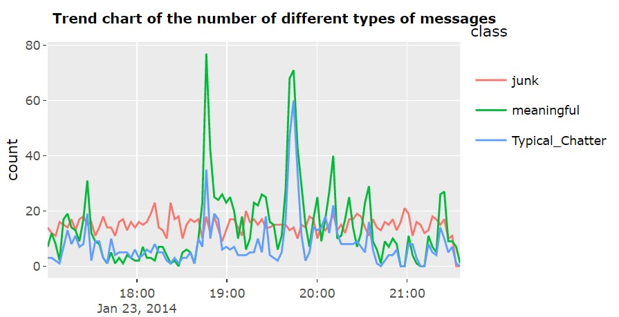
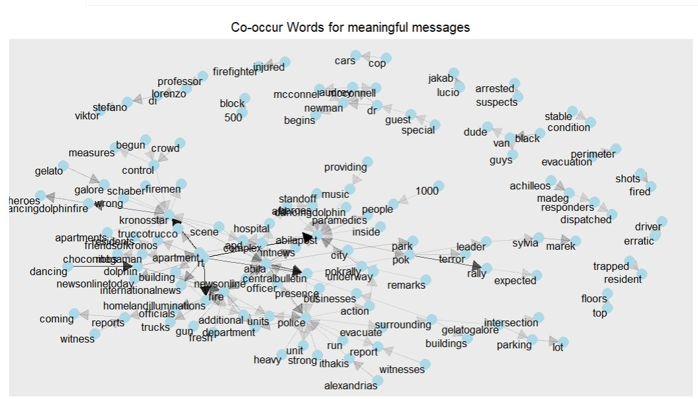
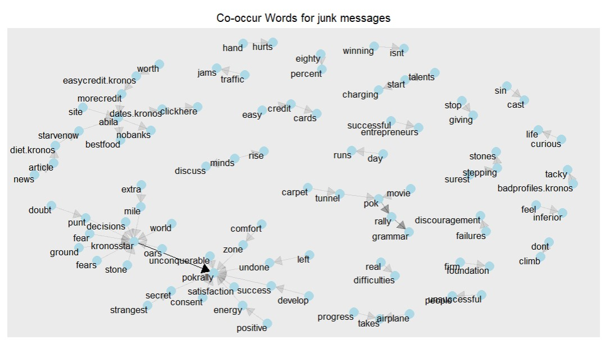
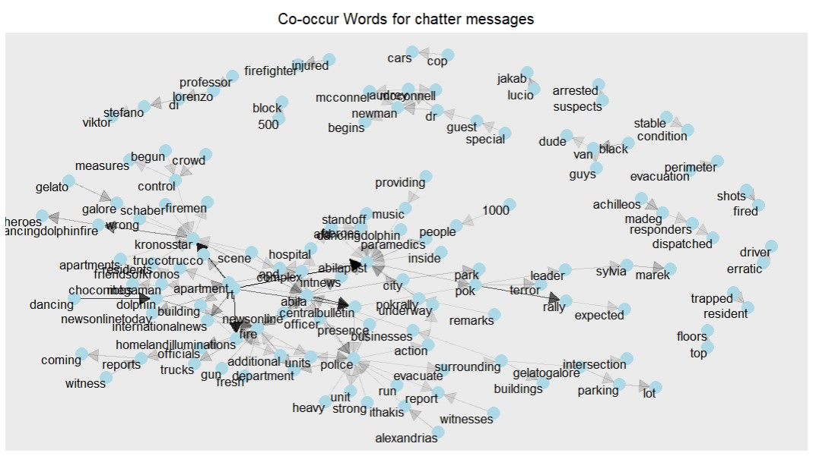
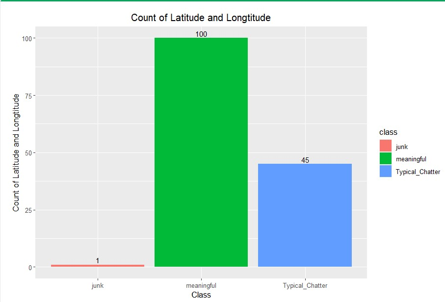
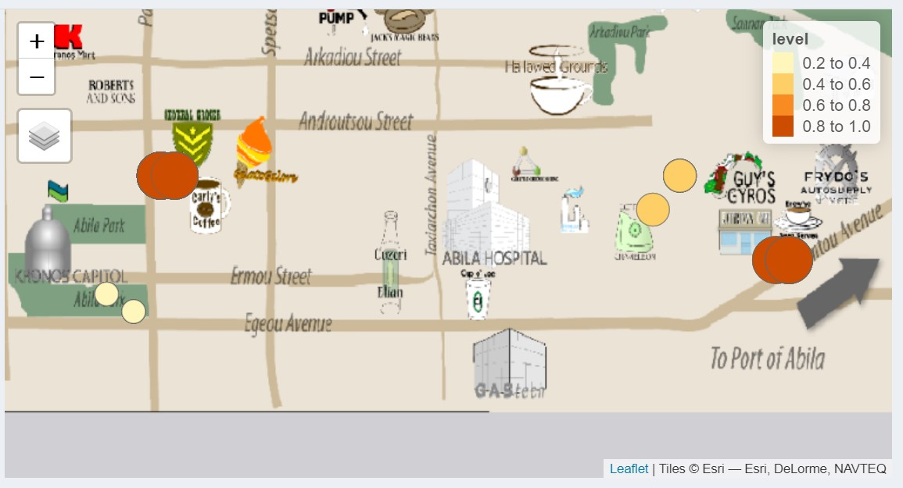

```{r, include=FALSE}
knitr::opts_chunk$set(echo = FALSE,
                      warning = FALSE,
                      tidy = FALSE,
                      message = FALSE,
                      fig.align = 'center',
                      out.width = "100%")
options(knitr.table.format = "html") 
```

# Introduction

In the country island of Kronos, the increasing noxious effects on health and farming have been related to the uncontrolled activity of GAStech, a natural gas operator, supported by corrupt government officials. On January 20th, 2014, a corporate meeting is held to celebrate the new-found fortune because of the initial public offering of the company. However, a series of rare events occur that lead to the disappearance of several employees. The Protectors of Kronos (POK), a social movement organization that has been fighting against water contamination and government corruption, is suspected in the disappearance.

```{r, include=FALSE}
knitr::write_bib(c('posterdown', 'rmarkdown','pagedown'), 'packages.bib')
```

## Objectives

- Identify meaningful, junk and chatter messages.
- Evaluate and show the risk level of events.
- Decide target places of responders.

# Meaningful, Junk and Chatter Messages

Class| Description
-----| -----------
Junk|Advertisements or financial purpose reports.
Meaningful|Informative records which spread real news about events happen in Aliba.
Typical Chatter|Represents no inappropriate messages post online.

For meaningful news, there are two peaks around 18:40 and 19:40, and the corresponding events are the dancing dolphin fire incident and the black truck incident.For typical chatter, the peak at 19:40 coincides with the peak of meaningful messages.For junk, there was no obvious peak in the number of messages during the night period.

```{r,echo=FALSE,results='hide',message=FALSE, warning=FALSE}

packages = c('tidytext', 'tidyverse','dplyr','tm',
             'widyr', 'wordcloud','lubridate','wordcloud',
             'DT', 'ggwordcloud', 'SnowballC','ggplot2',
             'tokenizers', 'lubridate', 'topicmodels','stringr',
             'hms','tidyverse', 'stringr','clock','tmap',
             'tidygraph', 'ggraph', 'tidytext','dygraphs','sf',
             'igraph','rgdal','raster','sp','patchwork','hrbrthemes',
             'ggraph','shinydashboard','thematic','rsconnect',
             'pagedown','posterdown','devtools','tidyverse','readr')

for(p in packages){
  if(!require(p, character.only = T)){
    install.packages(p)
  }
  library(p, character.only = T)
}
a <- read_rds('YourDirectory/a.rds')
abila <- read_rds('YourDirectory/abila.rds')
abilia_st <- read_rds('YourDirectory/abilia_st.rds')
b <- read_rds('YourDirectory/b.rds')
ccdata <- read_rds('YourDirectory/ccdata.rds')
data <- read_rds('YourDirectory/data.rds')
data2 <- read_rds('YourDirectory/data2.rds')
fire <- read_rds('YourDirectory/fire.rds')
fire_count <- read_rds('YourDirectory/fire_count.rds')
frequency <- read_rds('YourDirectory/frequency.rds')
gps_m <- read_rds('YourDirectory/gps_m.rds')
gps_point <- read_rds('YourDirectory/gps_point.rds')
gps_sf <- read_rds('YourDirectory/gps_sf.rds')
hit <- read_rds('YourDirectory/hit.rds')
hit_count <- read_rds('YourDirectory/hit_count.rds')
junk <- read_rds('YourDirectory/junk.rds')
junk_bigrams <- read_rds('YourDirectory/junk_bigrams.rds')
junk_counts <- read_rds('YourDirectory/junk_counts.rds')
junk_filtered <- read_rds('YourDirectory/junk_filtered.rds')
junk_graph <- read_rds('YourDirectory/junk_graph.rds')
junk_separated <- read_rds('YourDirectory/junk_separated.rds')
junk_usenet_words <- read_rds('YourDirectory/junk_usenet_words.rds')
mb_tf_idf <- read_rds('YourDirectory/mb_tf_idf.rds')
mb_usenet_words <- read_rds('YourDirectory/mb_usenet_words.rds')
mbdata <- read_rds('YourDirectory/mbdata,rds')
mbdata_classed <- read_rds('YourDirectory/mbdata_classed.rds')
mbdata1 <- read_rds('YourDirectory/mbdata1.rds')
mbwords_by_class <- read_rds('YourDirectory/mbwords_by_class.rds')
meaningful_bigrams <- read_rds('YourDirectory/meaningful_bigrams.rds')
meaningful_counts <- read_rds('YourDirectory/meaningful_counts.rds')
meaningful_filtered <- read_rds('YourDirectory/meaningful_filtered.rds')
meaningful_graph <- read_rds('YourDirectory/meaningful_graph.rds')
meaninful_separated <- read_rds('YourDirectory/meaninful_separated.rds')
meaningful_usenet_words <- read_rds('YourDirectory/meaningful_usenet_words.rds')
q3_gps <- read_rds('YourDirectory/q3_gps.rds')
table1 <- read_rds('YourDirectory/table1.rds')
table2 <- read_rds('YourDirectory/table2.rds')
table3 <- read_rds('YourDirectory/table3.rds')
Typical_Chatter <- read_rds('YourDirectory/Typical_Chatter.rds')
Typical_Chatter_bigrams <- read_rds('YourDirectory/Typical_Chatter_bigrams.rds')
Typical_Chatter_counts <- read_rds('YourDirectory/Typical_Chatter_counts.rds')
Typical_Chatter_filtered <- read_rds('YourDirectory/Typical_Chatter_filtered.rds')
Typical_Chatter_graph <- read_rds('YourDirectory/Typical_Chatter_graph.rds')
Typical_Chatter_separated <- read_rds('YourDirectory/Typical_Chatter_separated.rds')
usenet_words <- read_rds('YourDirectory/usenet_words.rds')
```



## The difference of key words

#### Single word frequency

Junk records is more macroscopic. Meaningful records contains important social-event topic words, such as “fire”,“rally”, and “van”. Comparably, the common words of typical-chatter are fewer and people usually end with a metatag “tag” if they post typical-chatter records.

```{r,echo=FALSE,message=FALSE, warning=FALSE,results='hold'，fig.height=4}
ggplot(a,aes(label = word,
                 size = 10,
                 color= class))+
      geom_text_wordcloud() +
      labs(x = "Record Classification") +
      facet_wrap(~class,ncol = 3,scales = "free")+
      ggtitle("Visualizing difference of word frequency by word cloud") +
      theme(plot.title = element_text(hjust = 0.5))
```

We also performed TF-IDF to find the less frequent but important words for each classification.
.jpg){width=60%} .jpg){width=30%}

### The difference of co-occur words

From the charts, we can find that there are clear arrows in the meaningful messages and typical chatter messages while junk messages have least co-occur words.

{width=30%} {width=30%} {width=30%}

#### The difference of sentence length

The median of sentence length for Junk is largest. Moreover, the shape of the distribution indicates the weights of Typical_chatter and Meaningful record are highly concentrated around the median, but this is not distinct for Junk records. 

```{r,echo=FALSE,message=FALSE, warning=FALSE,results='hold'}
mbdata_classed$length <- sapply(mbdata_classed$message, function(x)
length(unlist(strsplit(as.character(x), "\\W+"))))
    
ggplot(mbdata_classed ,aes(x = class, y = length)) + 
  geom_violin(aes(fill = class), trim = FALSE) +
  geom_boxplot(width = 0.1) +
  ggtitle("Visualizing Word Length within Three Records Classes") +
  theme(plot.title = element_text(hjust = 0.5)) +
  theme(legend.position = "none")
```

### The difference of geo information

In the messages blog dataset, we found that meaningful messages tend to have more geo information while junk messages have least geo information. 


# Risk of events

# Responders

To send the responders more efficiently, we decided to send them to dancing dolphin department first. Since the there was fire happened there, the risk of this area is one of the highest. Moreover, compare to the "Black Van" event, "Dancing Dolphin" event is the first severe event happened on Jan 23, 2014. Besides the factor of timing, the geo distance between dancing dolphin and black van event is low. Therefore, it will be easier for responders to stop black van in the first stage of event and prevent the more severe results.


# References
