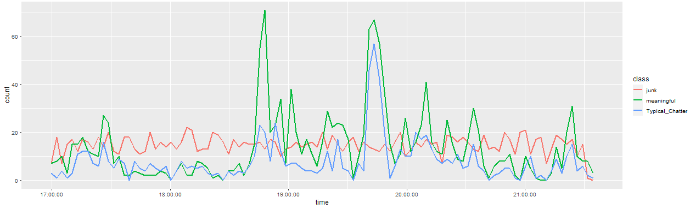
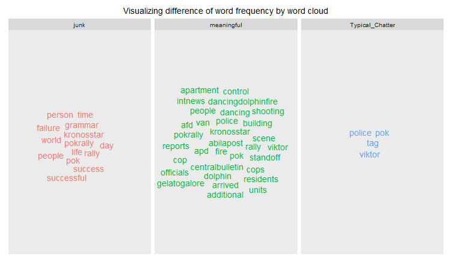
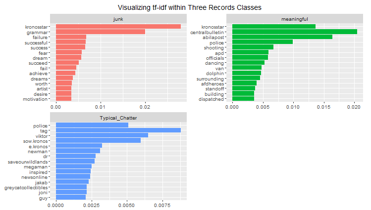
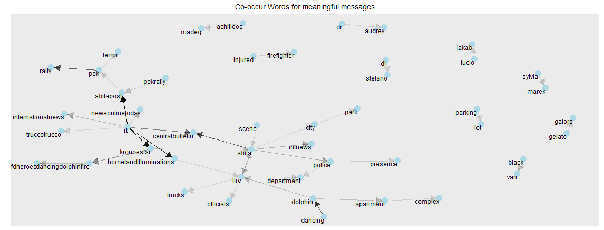
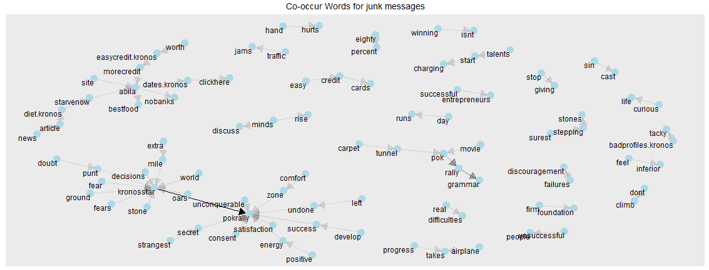
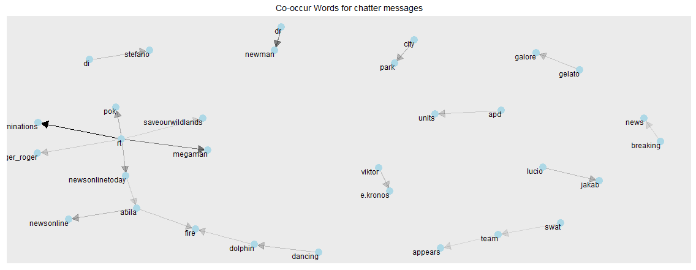
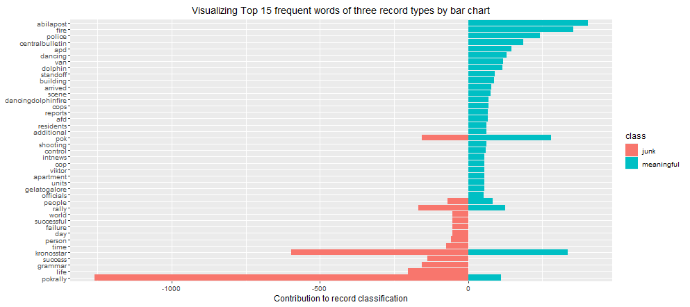
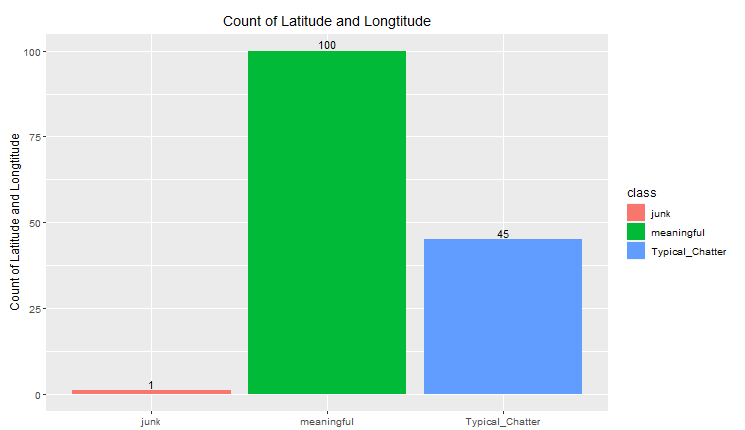
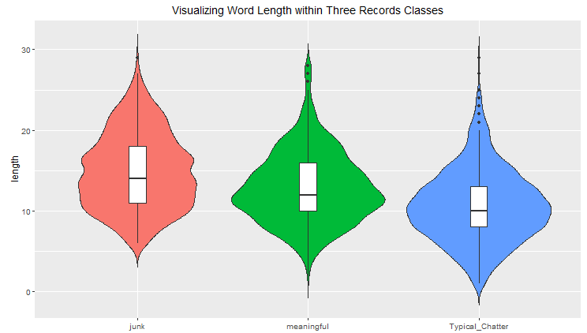
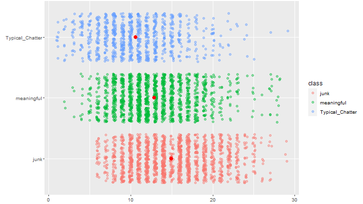

# Introduction 
In the country island of Kronos, the increasing noxious effects on health and farming have been related to the uncontrolled activity of GAStech, a natural gas operator, supported by corrupt government officials. On January 20th, 2014, a corporate meeting is held to celebrate the new-found fortune because of the initial public offering of the company. However, a series of rare events occur that lead to the disappearance of several employees. The Protectors of Kronos (POK), a social movement organization that has been fighting against water contamination and government corruption, is suspected in the disappearance.

As analysts, we were assigned with several tasks in order to identify risks and how they could have been mitigated more effectively.

The objective is to evaluate the changing levels of risk to the public and recommend actions for first responder:

+ Distinguish meaningful event reports from typical chatter from junk or spam.

+ Evaluate the level of the risk to the public evolves over the course of the evening. Consider the potential consequences of the situation and the number of people who could be affected.

+ Determine the appropriate location for first responders.

+ The differences between dealing with this challenge in 2014 and dealing with it now.

# Review and critic on past works

# Design framework

The application uses the free and open-source R language that offers a thriving programming environment for statistical and graphical analysis. Our 4 design considerations for development:

+ Performing calculations/logic within R for reproducibility,

+ Using standard R packages on the Comprehensive R Archive Network(CRAN) for supportability.

+ Using Shiny to webify the codes for simplicity.

+ Providing options and visualizations for interactivity.

## Data Source

There are three dataset in Mini-Challenge 3:

+ Microblog records that have been identified by automated filters as being potentially relevant to the ongoing incident.

+ Text transcripts of emergency dispatches by the Abila, Kronos local police and fire departments.

+ maps of Abila and background documents.

The data of Microblog and text transcripts of emergency dispatches are found in three segments:

+ Segment 1 :“csv-1700-1830.csv” - covers the time period from 1700 to 1830 Abila time on January 23.

+ Segment 2: "csv-1831-2000.csv’- covers the time period from 1830 to 2000 Abila time on January 23.

+ Segment 3: “csv-2001-2131.csv” - covers the time period from 2000 to shortly after 2130 Abila time on January 23.

The number of "Total Message", "Message Blog" and "Call Center" is 4063, 3872 and 191.

## Data Preparation

All data preparations are performed using R. We combined the data of Microblog and text transcripts and convert the date variable to right time format, which is necessary for the following analysis. And based on content of data provided, we classified records into three segments: Junk, Typical_Chatter and Meaningful records.

+ Junk: Referred to advertisements or financial purpose reports.

+ Meaningful: Refers to informative records which spread real news about ongoing or impending events happen in Aliba.

+ Typical Chatter: Represents no meaningful and irrelevant or inappropriate messages post online.

# Message labeling

Using "Figure 1" to show the number of different types of messages posted every two minutes from 17:00 to 21:30.

+ For meaningful news, there are two peaks around 18:40 and 19:40, and the corresponding events are the dancing dolphin fire incident and the black truck incident.

+ For typical chatter, the peak at 19:40 coincides with the peak of meaningful messages.

+ For junk, there was no obvious peak in the number of messages during the night period.

## The difference of key words

### Single word frequency

For junk records, its most frequent words are relate to “life”, “successful”, “time”, the style of junk record is more macroscopic. However, for meaningful records, its frequents words seems to be more various,and it contains important social-event topic words, such as “fire”,“rally”, and “van”. Comparably, the common words of typical-chatter are fewer and people usually end with a metatag “tag” if they post typical-chatter records. Since POK rally invested Viktor-E bank to play music, Viktor become the People Focus in typical-chatter.

### Co-occur word frequency

Compare Figure 4 to Figure 5 and 6, it is more frequently for words appear together in meaningful message than those appear in junk messages. This indicate that meaningful messages have more converge topics. Therefore, there were more fixed words groups in meaningful messages.

### Frequency comparation of key words in three classification 

## Geographical information of events

From Figure 8, the most geographical information from the meaningful messages, a small part from chatter messages. And the junk message provides one location which comes from the author "truccotrucco" who is an witness of pok rally but posted a lot of emotional messages without meaningful content.

## The difference of sentence length

The median of sentence length for Junk is largest, followed by Meaningful and Typical-chatter records respectively. Moreover, the shape of the distribution (extremely skinny on each end and wide in the middle) indicates the weights of Typical_chatter and Meaningful record are highly concentrated around the median, but this is not distinct for Junk records. Besides, Typical_chatter and Meaningful records have distinct wider section of violin plot, representing a higher probability that the sentence length of records will take on values of 10 and 12.

# Risk of events

# Responders

# References

---
references:
- id: meier2012
  title: Professinal Android 4 Application Development
  author: 
  - family: Meier
    given: Reto
  type: book
  publisher: John Wiley & Sons, Inc.
  issued:
    year: 2012
    month: 5
- id: fenner2012a
  title: One-click science marketing
  author:
  - family: Fenner
    given: Martin
  container-title: Nature Materials
  volume: 11
  URL: 'https://doi.org/10.1038/nmat3283'
  DOI: 10.1038/nmat3283
  issue: 4
  publisher: Nature Publishing Group
  page: 261-263
  type: article-journal
  issued:
    year: 2012
    month: 3
...

